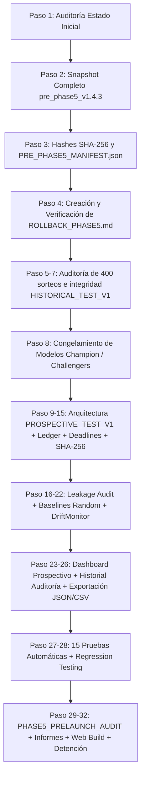

# Plan de Implementación — FASE 5 DEFINITIVA: Validación Prospectiva Ciega

Infraestructura científica de **Validación Prospectiva Ciega**, auditoría inmutable de predicciones pre-sorteo, seguridad criptográfica con SHA-256, Ledger inmutable, detección de data leakage, baselines analíticos/Monte Carlo y dashboard de monitoreo en **Quiniela Master Pro**, preservando al 100% la funcionalidad existente y **sin generar APK** (según instrucción expresa).

---

## User Review Required

> [!IMPORTANT]
> **POLÍTICA DE PRESERVACIÓN Y REGLA DE SEGURIDAD (FASE 5)**:
> 1. **CERO optimización o reentrenamiento**: No se modificarán hiperparámetros, pesos, ventanas ni fórmulas de los modelos actuales (`ML-FULL`, `ML-TREND`, `Frequency Simple`, `Markov Pure`, `Baseline Heurístico`, `Random`).
> 2. **CERO APK**: Se omitirá la compilación de APK/AAB conforme a la instrucción expresa del usuario (`SIN realizar apk sigue este procedimiento`). Las verificaciones se realizarán mediante pruebas automáticas, build web de producción (`npm run build`) y auditoría en terminal/Node.
> 3. **INMUTABILIDAD DE HISTORICAL_TEST_V1**: Los 400 sorteos congelados del test histórico quedan protegidos bajo modo solo lectura y nunca se reutilizarán para calibrar o elegir modelos.
> 4. **INMUTABILIDAD DE PREDICTIVE AUDIT LEDGER**: Cada predicción futura debe quedar firmada criptográficamente (SHA-256) y bloqueada antes del deadline del sorteo.

---

## Orden Obligatorio de Ejecución (38 Pasos / 40 Bloques)

---

## Proposed Changes

### Bloque 1: Protección Total & Rollback
#### [NEW] [PHASE5_INITIAL_STATE_REPORT.md](file:///C:/Users/enero/.gemini/antigravity/scratch/quiniela-pro-app/PHASE5_INITIAL_STATE_REPORT.md)
- Registro del estado actual: Versión app (1.4.3 / Code 75), commit git, dependencias, estructura de modelos y datasets.

#### [NEW] [PRE_PHASE5_MANIFEST.json](file:///C:/Users/enero/.gemini/antigravity/scratch/quiniela-pro-app/PRE_PHASE5_MANIFEST.json)
- Manifiesto canónico con hashes SHA-256 de todos los archivos críticos del proyecto antes de cualquier cambio.

#### [NEW] [releases/pre_phase5_v1.4.3/](file:///C:/Users/enero/.gemini/antigravity/scratch/quiniela-pro-app/releases/pre_phase5_v1.4.3)
- Snapshot recuperable completo de código fuente, configuraciones, modelos y datasets.

#### [NEW] [ROLLBACK_PHASE5.md](file:///C:/Users/enero/.gemini/antigravity/scratch/quiniela-pro-app/ROLLBACK_PHASE5.md)
- Procedimiento paso a paso para restaurar el sistema al estado exacto anterior. Verificación de rollback ejecutada (`ROLLBACK_VERIFIED = PASS`).

---

### Bloque 2: Auditoría e Integridad de los 400 Sorteos
#### [NEW] [HISTORICAL_TEST_V1_INTEGRITY_REPORT.md](file:///C:/Users/enero/.gemini/antigravity/scratch/quiniela-pro-app/HISTORICAL_TEST_V1_INTEGRITY_REPORT.md)
- Resolución documental exhaustiva de la inconsistencia `#1826–#2225` (1-indexed) vs `#1825–#2224` (0-indexed).
- Verificación de los 400 sorteos exactos entre `2026-07-19` y `2026-09-03`.
- Cálculo del hash SHA-256 determinista del dataset histórico congelado.

---

### Bloque 3: Congelamiento de Modelos (Champion, Challengers, Baselines)
#### [NEW] [backend/ml_pipeline/frozen_models_registry.json](file:///C:/Users/enero/.gemini/antigravity/scratch/quiniela-pro-app/backend/ml_pipeline/frozen_models_registry.json)
- Registro de metadatos, parámetros y hashes SHA-256 de:
  - **CHAMPION**: `ML-FULL` (`Logistic Regression + Markov Features v1.0`).
  - **CHALLENGER 1**: `ML-TREND`.
  - **CHALLENGER 2**: `Frequency Simple`.
  - **CHALLENGER 3**: `Markov Pure`.
  - **BASELINE**: `Heuristic Baseline`.
  - **RANDOM**: Baselines aleatorios.
#### [NEW] [FUTURE_EXPERIMENTS.json](file:///C:/Users/enero/.gemini/antigravity/scratch/quiniela-pro-app/FUTURE_EXPERIMENTS.json)
- Registro de ideas y propuestas de optimización futuras (status: `NOT_TESTED`).

---

### Bloques 4–15: Motor de Validación Prospectiva Ciega & Ledger Inmutable
#### [NEW] [backend/ml_pipeline/prospective_validation_engine.py](file:///C:/Users/enero/.gemini/antigravity/scratch/quiniela-pro-app/backend/ml_pipeline/prospective_validation_engine.py)
- `PROSPECTIVE_TEST_V1`: Registro exclusivo de sorteos posteriores al final de `HISTORICAL_TEST_V1` (> `2026-09-03_provincia_nocturna`).
- `PredictionAuditLedger`:
  - `prediction_id`, `jurisdiction`, `draw_date`, `shift`, `scheduled_draw_time`.
  - `prediction_created_at`, `prediction_locked_at`, `prediction_deadline`, `official_result_received_at`.
  - Regla temporal estricta: `created < locked < deadline < result_received`.
  - Inmutabilidad estricta: si `prediction_locked = true`, cualquier intento de alteración falla o marca `prediction_status = INVALID`.
  - Hash canónico SHA-256 determinista por predicción.
  - Snapshots reproducibles con `reproduce_prediction(prediction_id)`.
  - Manejo de predicciones faltantes / tardías (`prediction_status = NO_VALID_PREDICTION`).

---

### Bloques 11–12, 16–20: Auditoría de Fuga, Baselines Estadísticos & Drift Monitor
#### [NEW] [backend/ml_pipeline/prospective_audit_suite.py](file:///C:/Users/enero/.gemini/antigravity/scratch/quiniela-pro-app/backend/ml_pipeline/prospective_audit_suite.py)
- `prospective_leakage_audit()`:
  - Temporal Leakage, Target Leakage, Dataset Leakage, Model Leakage, Selection Leakage, Evaluation Leakage.
- Baselines Aleatorios:
  - **Random A (Reproducible)**: Semilla documentada sin reemplazo.
  - **Random B (Expectativa Analítica)**: Probabilidad combinatoria exacta para ambos en pizarra/cabeza sin supuestos falsos de independencia.
  - **Random C (Monte Carlo)**: $N=10.000$ simulaciones con distribución percentil (2.5%, 5%, 50%, 95%, 97.5%).
- Métricas Formales:
  - Hit Rate@K vs Precision@K con Intervalos de Confianza al 95% (Wilson / Clopper-Pearson).
  - Test pareado de McNemar y tests para variables ordinales pareadas con ajuste por comparaciones múltiples.
- `DriftMonitor`:
  - Detección de drift en frecuencias, unidades, decenas y scores (`NORMAL`, `MODERATE`, `HIGH`). Modo estrictamente observacional.
- Desglose por Jurisdicción (Ciudad vs Provincia) y Turno (Previa, Primera, Matutina, Vespertina, Nocturna).

---

### Bloques 21–25: Interfaz Web & Exportación (Desacoplada y No Destructiva)
#### [NEW] [frontend/src/services/prospectiveLedgerClient.js](file:///C:/Users/enero/.gemini/antigravity/scratch/quiniela-pro-app/frontend/src/services/prospectiveLedgerClient.js)
- Servicio cliente para consultar el Ledger inmutable, verificar hashes, consultar deadlines y exportar datos.
#### [MODIFY] [frontend/src/components/PredictiveAiDashboardTab.jsx](file:///C:/Users/enero/.gemini/antigravity/scratch/quiniela-pro-app/frontend/src/components/PredictiveAiDashboardTab.jsx)
- Incorporación de la subpestaña **"Validación Prospectiva"** protegida por feature flag (`PHASE5_PROSPECTIVE_VALIDATION_ENABLED = true`).
- Vista de KPIs prospectivos (Coverage, Champion `ML-FULL`, Hit Rate@K, Precision@K, Leakage Events: 0, Drift Status).
- Tabla comparativa formal de modelos (Champion vs Challengers vs Baselines).
- Vista interactiva de auditoría del Ledger con hashes SHA-256 y estados.
- Botones de exportación directa a **JSON** y **CSV**.

---

### Bloques 26–36: Pruebas Automáticas, Auditoría Prelaunch y Reportes
#### [NEW] [backend/ml_pipeline/test_phase5_suite.py](file:///C:/Users/enero/.gemini/antigravity/scratch/quiniela-pro-app/backend/ml_pipeline/test_phase5_suite.py)
- Batería de 15 pruebas automáticas obligatorias del Bloque 26.
#### [NEW] [PHASE5_IMPLEMENTATION_REPORT.md](file:///C:/Users/enero/.gemini/antigravity/scratch/quiniela-pro-app/PHASE5_IMPLEMENTATION_REPORT.md)
#### [NEW] [PHASE5_REGRESSION_TEST_REPORT.md](file:///C:/Users/enero/.gemini/antigravity/scratch/quiniela-pro-app/PHASE5_REGRESSION_TEST_REPORT.md)
#### [NEW] [PHASE5_PRELAUNCH_AUDIT.md](file:///C:/Users/enero/.gemini/antigravity/scratch/quiniela-pro-app/PHASE5_PRELAUNCH_AUDIT.md)

---

## Verification Plan

### Automated Tests
1. **Pruebas de Seguridad y Ledger de Fase 5**:
   `python backend/ml_pipeline/test_phase5_suite.py`
   - Test 1: Inmutabilidad de predicción LOCKED.
   - Test 2: Imposibilidad de temporal / target leakage.
   - Test 3: Rechazo de predicciones retrospectivas.
   - Test 4: Inmutabilidad estricta de `HISTORICAL_TEST_V1`.
   - Test 5 & 6: Determinismo y sensibilidad del hash SHA-256.
   - Test 7: Rechazo de predicciones posteriores al deadline.
   - Test 8: Sorteos sin predicción válida no contabilizados como fallo predictivo.
   - Test 9: No reemplazo automático de Champion por Challengers.
   - Test 10: Disponibilidad de datos históricos.
   - Test 11: Generación continua de predicciones normales en la app.
   - Test 12: Preservación total del dashboard actual.
   - Test 13 & 14: Sincronización continua e idempotencia (cero duplicados).
   - Test 15: Disponibilidad y verificación de rollback.
2. **Suite de Auditoría Prelaunch**:
   `python backend/ml_pipeline/prospective_audit_suite.py --prelaunch`
3. **Build Web de Producción (Sin APK)**:
   `npm run build` en `frontend/`.
4. **Verificación de Regresión en Node/Navegador**:
   `node frontend/test_phase3_suite.mjs` y pruebas de carga de componentes.
